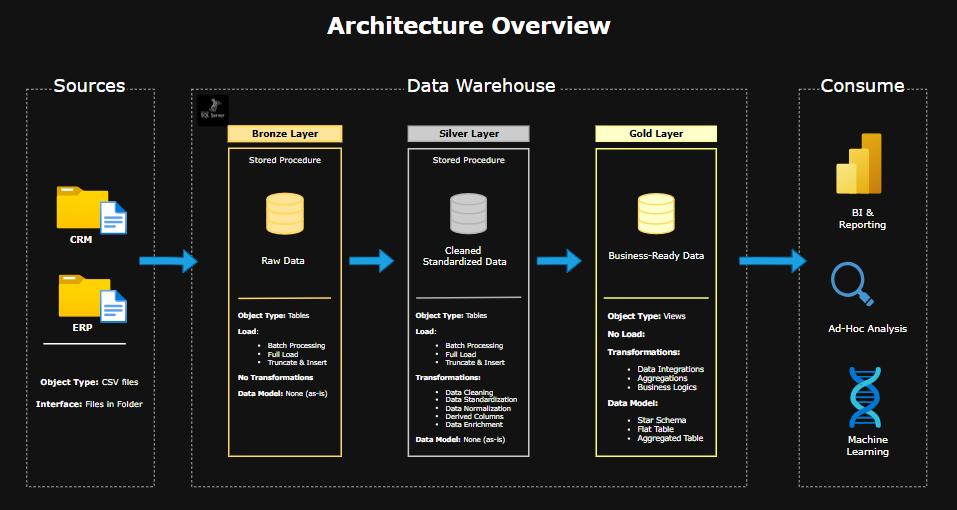

# End-to-End Data Warehouse & Analytics Project

Welcome to the **Data Warehouse and Analytics Project** repository!  
This project demonstrates a comprehensive data warehousing and analytics solution, from building a data warehouse to generating actionable insights. Designed as a portfolio project, it highlights industry best practices in data engineering and analytics.

This repository provides a step-by-step approach to building a scalable and efficient data warehouse, covering:

- ✅ ETL Pipelines (Extract, Transform, Load)
- ✅ Data Modeling (Star Schema)
- ✅ SQL-based Reporting & Analytics

---
## 🏗️ Data Architecture

The data architecture for this project follows Medallion Architecture **Bronze**, **Silver**, and **Gold** layers:


1. **Bronze Layer**: Stores raw data as-is from the source systems. Data is ingested from CSV Files into SQL Server Database.
2. **Silver Layer**: This layer includes data cleansing, standardization, and normalization processes to prepare data for analysis.
3. **Gold Layer**: Houses business-ready data modeled into a star schema required for reporting and analytics.

---
## 📖 Project Overview

This project involves:

1. **Data Architecture**: Designing a Modern Data Warehouse Using Medallion Architecture **Bronze**, **Silver**, and **Gold** layers.
2. **ETL Pipelines**: Extracting, transforming, and loading data from source systems into the warehouse.
3. **Data Modeling**: Developing fact and dimension tables optimized for analytical queries.
4. **Analytics & Reporting**: Creating SQL-based reports and dashboards for actionable insights.

---

## 🚀 Project Requirements

### Building the Data Warehouse (Data Engineering)

#### Objective
Develop a modern data warehouse using SQL Server to consolidate sales data, enabling analytical reporting and informed decision-making.

#### Specifications
- **Data Sources**: Import data from two source systems (ERP and CRM) provided as CSV files.
- **Data Quality**: Cleanse and resolve data quality issues prior to analysis.
- **Integration**: Combine both sources into a single, user-friendly data model designed for analytical queries.
- **Scope**: Focus on the latest dataset only; historization of data is not required.
- **Documentation**: Provide clear documentation of the data model to support both business stakeholders and analytics teams.

---

### BI: Analytics & Reporting (Data Analysis)

#### Objective
Develop SQL-based analytics to deliver detailed insights into:
- **Customer Behavior**
- **Product Performance**
- **Sales Trends**

These insights empower stakeholders with key business metrics, enabling strategic decision-making.  

---

## 🛠️ Technology Stack & Tools

**Database:**; SQL Server
- **ETL Processing:**; Transact-SQL (T-SQL)
- **Data Modeling & Visualization:**; Draw.io
- **Project Management:**; Notion
- **Version Control:**; Git & GitHub

---

## 📂 Repository Structure
```
analytical-report/
├── 01_exploratory-data-analysis/
│   ├── 00_init_database.sql
│   ├── 01_database_exploration.sql
│   ├── 02_dimensions_exploration.sql
│   ├── 03_date_range_exploration.sql
│   ├── 04_measures_exploration.sql
│   ├── 05_magnitude_analysis.sql
│   ├── 06_ranking_analysis.sql
│   └── README.md
│
├── 02_advanced-analytics/
│   ├── 07_change_over_time_analysis.sql
│   ├── 08_cumulative_analysis.sql
│   ├── 09_performance_analysis.sql
│   ├── 10_data_segmentation.sql
│   ├── 11_part_to_whole_analysis.sql
│   └── README.md
│
├── 03_report-generation/
│   ├── 12_report_customers.sql
│   ├── 13_report_products.sql
│   └── README.md
│
├── datasets/
│   ├── source_crm/
│   │   ├── cust_info.csv
│   │   ├── prd_info.csv
│   │   └── sales_details.csv
│   │
│   ├── source_erp/
│   │   ├── CUST_AZ12.csv
│   │   ├── LOC_A101.csv
│   │   └── PX_CAT_G1V2.csv
│
├── docs/
│   ├── Architecture_overview.drawio
│   ├── Architecture_overview.png
│   ├── data_catalog.md
│   ├── data_flow_diagram.drawio
│   ├── data_flow_diagram.png
│   ├── data_model.drawio
│   ├── data_model.png
│   ├── integration_model.drawio
│   ├── integration_model.png
│   └── naming_conventions.md
│
├── scripts/
│   ├── bronze/
│   │   ├── ddl_bronze.sql
│   │   └── proc_load_bronze.sql
│   │
│   ├── silver/
│   │   ├── ddl_silver.sql
│   │   └── proc_load_silver.sql
│   │
│   ├── gold/
│   │   ├── structured_csv_data/
│   │   │   ├── dim_customers.csv
│   │   │   ├── dim_products.csv
│   │   │   └── fact_sales.csv
│   │   │
│   │   └── ddl_gold.sql
│   │
│   └── init_database.sql
│
├── tests/
│   ├── quality_checks_bronze.sql
│   ├── quality_checks_silver.sql
│   └── quality_checks_gold.sql
│
├── LICENSE
└── README.md

```
---


## 🛡️ License

This project is licensed under the [MIT License](LICENSE). You are free to use, modify, and share this project with proper attribution.

---

## About Me

[](https://linkedin.com/in/Nakia-Grier)
